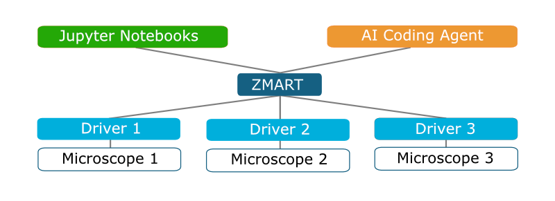

# ZMART Microscopy

**ZMB's Microscopy-Agnostic Research Toolkit (ZMART).**

This toolkit gives you programmatic control of a wide range of microscopes
through a simple, unified scripting philosophy, so you can quickly build
interoperable, adaptive feedback microscopy workflows. It is developed at the
Center for Microscopy and Image Analysis (ZMB), University of Zurich.

<br/>

<p align="center">
  
</p>

<br/>

## ZMART Controller

The vendor-agnostic API for driving a microscope — small, consistent, and the
same for every vendor. The pattern is always **discover, then apply**. Call a
`get_*` to see what the instrument supports; each option lists its allowed values
and the one that's active. Then pass your choice to the matching call. Write it
once, and it runs on any microscope that has a driver.

Full API and per-call docs: **[ZMART Controller »](zmart_controller/README.md)**

```python
import zmart_controller

# 1) Get the available instruments and connect to one
zmart_controller.get_instruments()
zmart_controller.set_instrument(instrument=Dict)

# 2) Set the origin point of the frame (current position becomes 0, 0, 0)
zmart_controller.set_origin()

# 3) Discover actuators, then read or move the position in the frame
zmart_controller.get_actuators()
zmart_controller.get_xyz()
zmart_controller.set_xyz(x, y, z, with_actuators=Dict)

# 4) Capture and reapply instrument state
zmart_controller.get_state()
zmart_controller.set_state(Dict)

# 5) Acquire data (captures and saves) with the current state and position
zmart_controller.get_acquisition_options()
zmart_controller.acquire(acquisition_type=String, position_label=String, options=Dict)

# 6) Run microscope-specific procedures (e.g. get run root / scan positions)
zmart_controller.get_procedures()
zmart_controller.run_procedure(Dict)

# 7) Optionally inspect extra diagnostic information the driver provides
zmart_controller.get_info()

# 8) Close the session
zmart_controller.disconnect()
```

## ZMART Drivers

Drivers live under `zmart_drivers/<vendor>/<machine>/<api>/` and are registered with
the controller through its registry (see the controller README), so adding a
vendor, microscope, or API is an additive change. Each driver documents its own
command model, state handling, and gotchas in its own README.

### Production-ready

| Microscope | API | Driver | Status |
|---|---|---|---|
| Leica STELLARIS 5 | LAS X CAM / Navigator Expert | [`zmart_drivers/leica/stellaris5_y42h93/navigator_expert/`](zmart_drivers/leica/stellaris5_y42h93/navigator_expert/README.md) | **Production-tested** — LAS X simulator + real STELLARIS |

### Under construction

| Microscope | API | Driver | Status |
|---|---|---|---|
| mesoSPIM (open-source light-sheet) | mesoSPIM-control (PyQt5; resident socket hook) | [`zmart_drivers/mesospim/`](zmart_drivers/mesospim/README.md) | **Demo-validated — near production** — the full round-trip **incl. `acquire`** passes against a live mesoSPIM `-D` demo (real software, simulated hardware); offline suite green, `run_ci.py` runs offline/online/both. GPL app driven at arm's length via a resident hook + MIT client. Pending real-hardware validation |
| ZEISS (ZEN) | ZEN API (gRPC) | [`zmart_drivers/zeiss/zenapi/`](zmart_drivers/zeiss/zenapi/README.md) | **Minimum viable product** — full offline suite green; not yet bench-validated (see [Risks](zmart_drivers/zeiss/zenapi/README.md#10-risks--bench-verify)) |
| Nikon (NIS-Elements 6.2) | NIS-Elements macros / NkSocket TCP | [`zmart_drivers/nikon/`](zmart_drivers/nikon/README.md) | **Investigation + spike** — socket round-trip proof landed; no production driver yet (device verbs still to be pinned) |
| Evident FLUOVIEW FV4000 (IX83) | FLUOVIEW RDK (TCP command server) | [`zmart_drivers/evident/`](zmart_drivers/evident/README.md) | **Investigation + planning** — RDK route mapped (Leica-CAM-symmetric); pending Evident developer-program access to the FV RDK command reference |

The ZMART Controller is the surface workflows should drive. The current Leica
target-acquisition workflow already uses it; the other adapters are still
maturing behind the same interface. As each driver matures it graduates from
**Under construction** to **Production-ready**.

## Architecture

The top-level layout — vendor-specific drivers up to vendor-neutral workflows,
plus setup and docs:

- **`zmart_drivers/`** — each driver speaks one microscope's native API and is keyed by
  `<vendor>/<machine>/<api>`. A driver owns its own calibration and limits. New
  microscopes are added here without touching workflows.
- **`zmart_controller/`** — the cross-vendor controller: one small, consistent interface
  a workflow drives, so the same workflow runs on any microscope that has a
  driver. This is the **emerging `zmart` surface** — the vendor-agnostic API the
  rest of the world would import. See its README for the full API and for how to
  register a new driver.
- **`shared/`** — genuinely vendor-independent limits and image algorithms
  (registration, focus). Output naming stays with each driver; workflow folders
  stay with the workflow.
- **`workflows/`** — the zmart-microscopy workflows themselves (current:
  `workflows/target_acquisition/`).
- **`getting_started/`** — setup and orientation: the one-step environment build,
  the conda-forge / PyPI rationale, and the typical path through the repo.
- **`docs/`** — project docs: the ZMART identity and architecture
  (`docs/ZMART.md`), the diagram, and design notes.

## Getting Started

Follow these four steps to go from a fresh clone to driving the microscope (full detail in `getting_started/`).

### 1. Clone the repository
First, download the code and enter the project directory:
```bash
git clone https://github.com/thomdehoog/ZMART-microscopy
cd ZMART-microscopy
```

### 2. Install the environment
The environment is built via `conda-forge`. Run the build script and then activate the environment:
```bash
# Create the "zmart-microscopy" env and install packages
python build_env.py --name zmart-microscopy

# Activate the environment
conda activate zmart-microscopy
```

The builder also installs and launches the matching Playwright Chromium,
verifies Node.js for generated-widget syntax checks, and import-checks the
notebook and CI dependencies. For a pip-based test environment use
`requirements-dev.txt`, then run `python -m playwright install chromium`.

### 3. Machine Setup (Limits, Orientation, & Calibration)
The driver reads machine-local configuration from `C:\ProgramData\zmart-microscopy\...`.
If ProgramData is empty, repo defaults are copied there so mock CI and first
connects can run; on the real microscope, replace those defaults with measured
values by running the setup notebooks:

For the production Leica Stellaris driver:

1.  **Set Stage Limits:** Defines the physical travel range.
    `zmart_drivers/leica/stellaris5_y42h93/navigator_expert/limits/notebooks/set_limits.ipynb`
    
3.  **Set Orientation:** Defines the stage coordinate system relative to the camera/detector.
    `zmart_drivers/leica/stellaris5_y42h93/navigator_expert/orientation/notebooks/set_orientation.ipynb`
    
5.  **Calibrate Objective Pair:** Defines the objective-pair translation for one lens configuration.
    Run it for each lens configuration you need.
    `zmart_drivers/leica/stellaris5_y42h93/navigator_expert/calibration/notebooks/calibrate_objective_pair.ipynb`

### 4. Run it

For the Leica Stellaris driver:

Navigate to the `navigator_expert` directory and execute the validation:
```bash
cd zmart_drivers/leica/stellaris5_y42h93/navigator_expert

# Mock/offline validation; no LAS X required
python run_ci.py

# Live bench validation; LAS X required, moves/acquires, restored where possible
python run_ci.py --hardware
```
