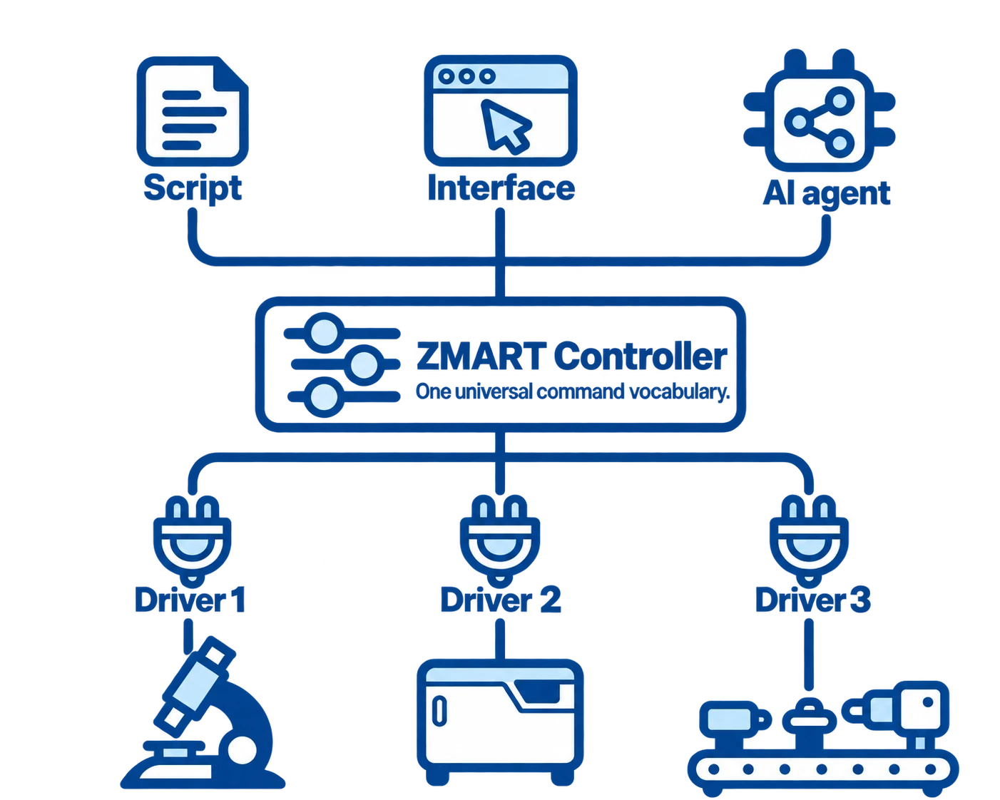

# ZMART Controller

[](https://www.python.org/downloads/)
[](LICENSE)
[](pyproject.toml)
[](#testing)


The **ZMART Controller** provides a small, universal schema for driving a microscope from Python.
You build your workflow on this schema, and it runs on any microscope that has a ZMART driver plugged into it.
It is part of **ZMART** (ZMB's Microscopy-Agnostic Research Toolkit), the tools we use for smart microscopy
at the Center for Microscopy and Image Analysis (ZMB), University of Zurich.
<br clear="left"/>

## The Problem

Every microscope comes with its own programming interface, so a workflow that is built for one microscope
does not work on another.

This is a real obstacle to sharing our workflows and deploying them on all the microscopes we want.


## The Solution

The ZMART controller lives between your workflow and the microscope:

1. **One universal interface.** A short list of plain commands to move in xyz,
   get and set the state of the microscope, and acquire an image.

2. **A schema, not a driver.** It provides a consistent, interoperable vocabulary
   that ZMART drivers plug into. The drivers take care of interacting with the microscope, enforcing limits,
   and providing a single absolute coordinate system that corresponds to the space in which you observe the specimen.


<p align="center">
  
</p>

Note: we are aware of the [useq-schema](https://github.com/pymmcore-plus/useq-schema) from the Micro-Manager community and of Anthropic's [Model Hardware Standard](https://www.anthropic.com/news/model-hardware-standard-research-preview). We might switch, because both have real upsides, but currently the useq-schema is not interoperable enough for our needs and the Model Hardware Standard is not released to the public yet.


### What is no longer your problem

Because the controller is this simple, a whole class of problems stops being
yours as soon as you write against it:

- **In an experiment**, you never touch vendor code, units, stage conventions
  or safety limits. If a move is unsafe, the driver refuses and you see why.
  
- **In a driver**, you never think about workflows, other microscopes or the
  controller's internals. You implement one function per command the controller asks for.
  
- **In the controller**, there is nothing to maintain. It keeps no state,
  caches nothing and refuses nothing of its own, so it cannot drift out of step
  with a microscope.


### The vocabulary

Everything you can say to a microscope:

```python
import zmart_controller

# 1) See which microscopes are available, and connect to one
zmart_controller.get_instruments()
zmart_controller.set_instrument(instrument=Dict)

# 2) Learn about the connected setup
zmart_controller.get_info()

# 3) Discover the motors, then read or move the position (micrometers)
zmart_controller.get_actuators()
zmart_controller.get_xyz()
zmart_controller.set_xyz(x, y, z, with_actuators=Dict)

# 4) Capture the instrument settings, and apply them again later
zmart_controller.get_state()
zmart_controller.set_state(Dict)

# 5) Capture and save an image with the current settings and position
zmart_controller.get_acquisition_options()
zmart_controller.acquire(acquisition_type=String, position_label=String, options=Dict)

# 6) Run a routine the microscope offers (for example autofocus)
zmart_controller.get_procedures()
zmart_controller.run_procedure(Dict)

# 7) Close the connection
zmart_controller.disconnect()
```

Every command answers with the same two things:

```python
{"success": True, "report": {...}}
```

`success` says whether the driver did what you asked. `report` is whatever the
driver has to say about it: a position, a saved-file record, a state. When
something unexpected happens, the answer is `success: False`, and the details are in `report`.
We have not defined a vocabulary for error messages at this point.


## Try it yourself 

 - [Install it and run a first experiment on the mock driver](examples/example_experiment.ipynb)
 - [Build your own workflow with the controller](examples/example_experiment.ipynb): the same notebook, cell by cell, is the template
 - [Build driver functions that plug into the ZMART-controller](zmart_controller/mock.py): the mock driver is a complete, readable example, and [the tests](tests/) show what a driver must do

### Status
This is version 0.1. At the ZMB we use it in our smart-microscopy workflows on a Leica STELLARIS.
Drivers for Nikon (NIS-Elements), ZEISS (ZEN) and the mesoSPIM light-sheet exist and pass their tests
against the vendors' simulators; they are waiting for validation on real hardware. An Evident driver is being investigated.

## Author
Thom de Hoog, Center for Microscopy and Image Analysis (ZMB), University of
Zurich (thom.dehoog@zmb.uzh.ch, thomdehoog@gmail.com).

## License
MIT License. See LICENSE file for details.

## Links

- [ZMART Microscopy](https://github.com/thomdehoog/ZMART-microscopy): the main repository, with the workflows and the drivers
- [ZMART drivers](https://github.com/thomdehoog/ZMART-microscopy/tree/main/zmart_drivers): the drivers that plug into this controller
- [Smart Analysis](https://github.com/thomdehoog/smart-analysis): the analysis engine that runs between acquisitions
- [ZMART viewer](https://github.com/thomdehoog/ZMART-viewer): the viewer
- [Center for Microscopy and Image Analysis (ZMB)](https://www.zmb.uzh.ch), University of Zurich
