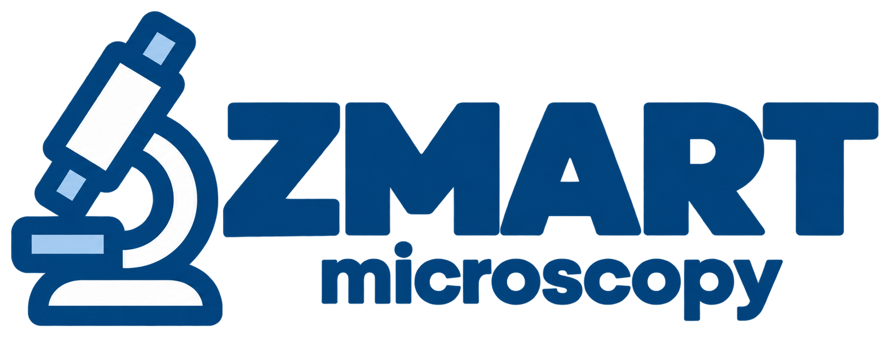
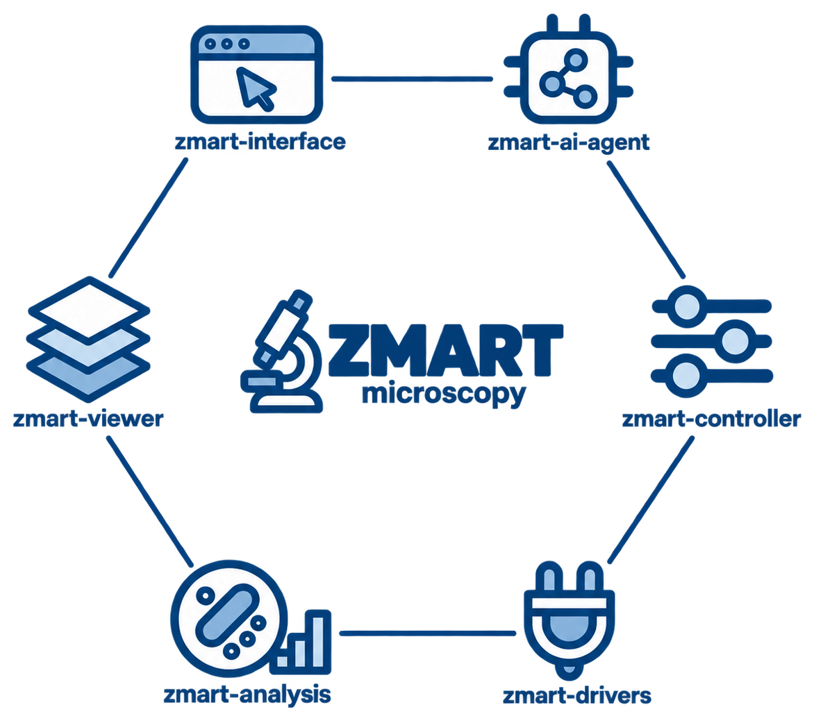
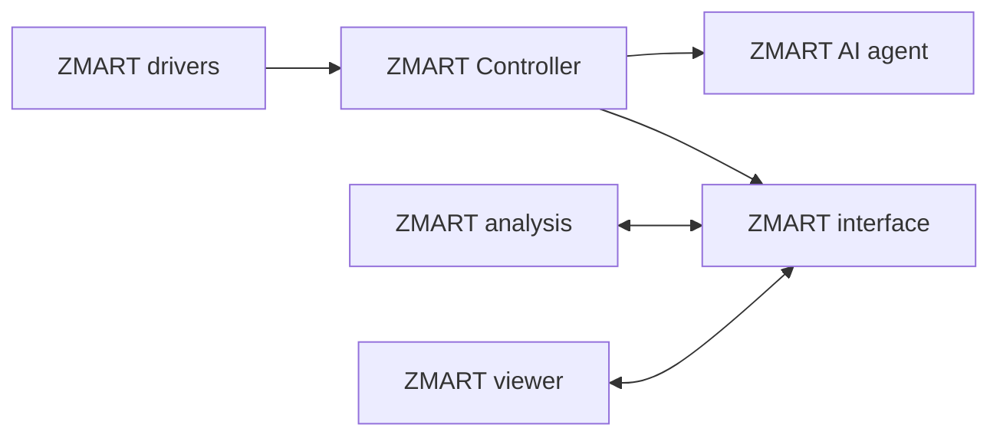

# ZMART Microscopy

[](https://www.python.org/downloads/)
[](LICENSE)
[](#testing)
[](.github/workflows/assembly.yml)
[](#status)



**ZMART** (ZMB's Microscopy-Agnostic Research Toolkit) is the set of tools we use for smart microscopy
at the Center for Microscopy and Image Analysis (ZMB), University of Zurich.
This repository puts them together.
<br clear="left"/>

## The Problem

Smart microscopy is a loop: take a picture, decide what is interesting, and image that next,
without someone at the microscope making every decision. Running that loop needs several things
at once: a way to drive the microscope, whatever its make; a window for the operator; analysis
between acquisitions; and a viewer for pictures that are still being taken. Built as one program,
all of this only works on the microscope it was written for, and a change to one part can quietly
break another.

## The Solution

ZMART is six building blocks, each in its own repository, each usable on its own:

<p align="center">
  
</p>


| Block | What it does |
|---|---|
| [ZMART drivers](https://github.com/thomdehoog/ZMART-drivers) | One driver per microscope (Leica, Nikon, ZEISS, mesoSPIM), each translating the controller's commands into what that microscope understands |
| [ZMART Controller](https://github.com/thomdehoog/ZMART-controller) | A short list of plain commands (move, read the state, acquire) that works the same on every microscope with a driver |
| [ZMART interface](https://github.com/thomdehoog/ZMART-interface) | The operator window: scan an overview, find targets, image them again |
| [ZMART analysis](https://github.com/thomdehoog/ZMART-analysis) | The analysis engine that runs between acquisitions (focus, object detection), each step in its own environment |
| [ZMART viewer](https://github.com/thomdehoog/ZMART-viewer) | Shows a run as OME-Zarr while it is still being acquired |
| [ZMART AI agent](https://github.com/thomdehoog/ZMART-ai-agent) | Drives a microscope when you ask in your own words |

They plug together like this:


```mermaid
flowchart LR
    D["ZMART drivers"] --> C["ZMART Controller"]
    C --> I["ZMART interface"]
    C --> G["ZMART AI agent"]
    A["ZMART analysis"] <--> I
    V["ZMART viewer"] <--> I
```

The microscope path runs from a driver, through the controller, to the interface. Nothing above
the controller needs to know which microscope is underneath. The analysis engine and the viewer
are side services plugged into the interface: it hands the analysis a focus stack or a field and
gets numbers back, and the viewer serves every capture to the operator's canvas. The AI agent
talks to the controller directly.

This repository assembles five of them (the AI agent is installed on its own): `install.py`
installs them from GitHub into one environment, the checks in `tests/` ask the questions where
they meet, and `run_walk.py` walks the operator window from start to finish on a pretend
microscope. The [workflows](workflows/) composed from the blocks will live here too.

The code that used to live in this repository, before the blocks had repositories of their own,
is kept in its git history and in the archive branch.

## Try it yourself

You need conda (Miniforge or Miniconda, used with conda-forge only) and an internet connection.
From a clone of this repository:

```bash
python install.py                    # the environment, the five blocks, and what the checks need
conda activate zmart-integration
python -m pytest tests               # the plug-in checks, a few minutes
python run_walk.py                   # the operator window, end to end, 10 to 30 minutes
```

`install.py` creates the environment `zmart-integration` from [`environment.yml`](environment.yml)
(conda-forge only), installs the five blocks with pip straight from GitHub, clones the controller,
the analysis and the interface into `work/` (for their mock driver, workflows and browser walk,
which are not part of the packages), makes the analysis environments the walk needs if they are
missing, and installs the walk's Node.js tools and Chromium. What was installed, at which commit,
is written to `work/install-record.json`; the walk keeps a screenshot of every screen and its log
in `work/walk/<date>/`.

**On Windows computers where programs may only run from approved folders** (AppLocker), keep
this repository and the environment in an approved folder, and point `PLAYWRIGHT_BROWSERS_PATH`
and `TMPDIR` at approved folders too: the analysis engine starts each step with `conda run`,
which writes a small script to the temporary folder and runs it.

### Status

This is a release candidate, checked against the `main` branch of each block. The latest run on
a Windows 11 workstation (2 October 2026; controller 0.1.0, drivers 0.1.0rc1, viewer 0.5.0rc1,
analysis 1.0.0rc1, interface 0.1.0rc1) is summarised here:

| What was checked | Result |
|---|---|
| The install, and `pip check` | passes |
| The plug-in checks (`tests/`) | 32 of 33 pass; the one that does not is below |
| The walk: all ten steps of the operator window on the kidney mock, against the installed blocks | passes (about 3.5 minutes) |

The one check that does not pass yet is left failing on purpose: it turns green when the block is
fixed, not when the check is loosened.

| Check | What does not fit | What needs to change |
|---|---|---|
| A capture from the controller's mock is served by the viewer | The capture fits the controller's contract and the interface writes it as OME-Zarr, but the viewer refuses to show it: "A live baked folder needs its full specimen canvas bounds". The interface always asks the viewer for a baked picture, with the canvas taken from `get_info`'s `canvas`, which is not part of the controller's contract. Only the kidney mock and the Leica driver declare one, so on any other microscope the operator's canvas stays empty. | Interface (`parts/storage/viewer_service.py`, `framework/bridge.py` `_connect`): take the canvas from what every driver reports, the travel range `get_xyz` gives for x and y, when `get_info` names none. Or the viewer (`zmart_viewer/views/publishing.py`, `_open`): build a baked picture without bounds given in advance. |

The Nikon, ZEISS and mesoSPIM drivers still report their `planes` as a count rather than one
entry per picture, so their captures do not yet fit the controller's contract. That driver work is
planned; until then, the checks here plug those drivers in and list them, and take pictures only
on the two mock microscopes.

## Testing

The plug-in checks are in [`tests/`](tests), one file per place where blocks meet:

| File | What it asks |
|---|---|
| `test_installed_versions.py` | `pip check` passes; every block came from its GitHub repository; each clone is at the installed commit; the interface accepts the installed viewer; the versions are written down |
| `test_drivers_plug_in.py` | every driver registers with the controller by module and by folder and is listed; both mock microscopes pass the controller's `validate_driver`; the two mocks stand side by side, and no other driver can take the kidney mock's name |
| `test_analysis_runs.py` | the engine finds the sharp plane of a focus stack in its own environment, directly and through the interface |
| `test_viewer_serves.py` | a capture from either mock fits the controller's contract, is kept by the interface's writer, and is served by the viewer |
| `test_bridge_answers.py` | the interface's bridge lists the kidney mock, serves the page, answers before Connect, passes a capture on as the controller's answer, and the walk's bridge runs the installed interface |

Every check gets an empty ZMART configuration folder of its own, and each driver is plugged in in
a fresh Python, so nothing on the computer changes the answer and nothing is left behind.

The continuous integration in [`.github/workflows/assembly.yml`](.github/workflows/assembly.yml)
runs every night and on demand: the plug-in checks on Ubuntu and Windows with Python 3.12, and the
walk on Ubuntu.

## Author
Thom de Hoog, Center for Microscopy and Image Analysis (ZMB), University of
Zurich (thom.dehoog@zmb.uzh.ch, thomdehoog@gmail.com).

## License
MIT License. See LICENSE file for details.

## Links

- [ZMART Controller](https://github.com/thomdehoog/ZMART-controller): the one vocabulary every microscope is driven with
- [ZMART drivers](https://github.com/thomdehoog/ZMART-drivers): the drivers that plug into the controller, one per microscope
- [ZMART interface](https://github.com/thomdehoog/ZMART-interface): the operator window
- [ZMART analysis](https://github.com/thomdehoog/ZMART-analysis): the analysis engine that runs between acquisitions
- [ZMART viewer](https://github.com/thomdehoog/ZMART-viewer): the viewer that shows the run as it is acquired
- [ZMART AI agent](https://github.com/thomdehoog/ZMART-ai-agent): driving a microscope by asking in your own words
- [Center for Microscopy and Image Analysis (ZMB)](https://www.zmb.uzh.ch), University of Zurich
