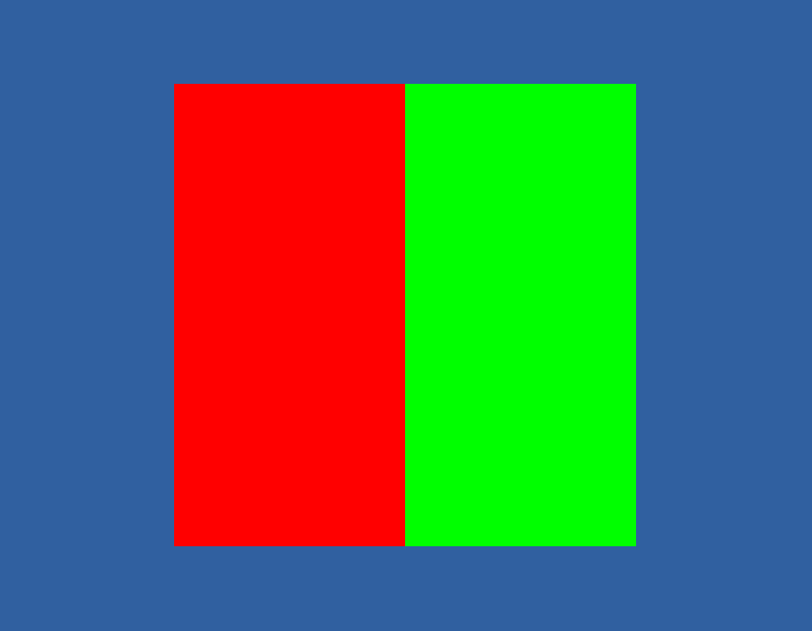
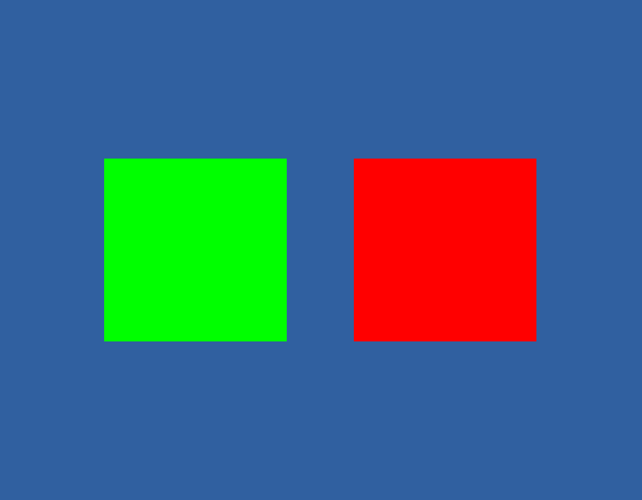
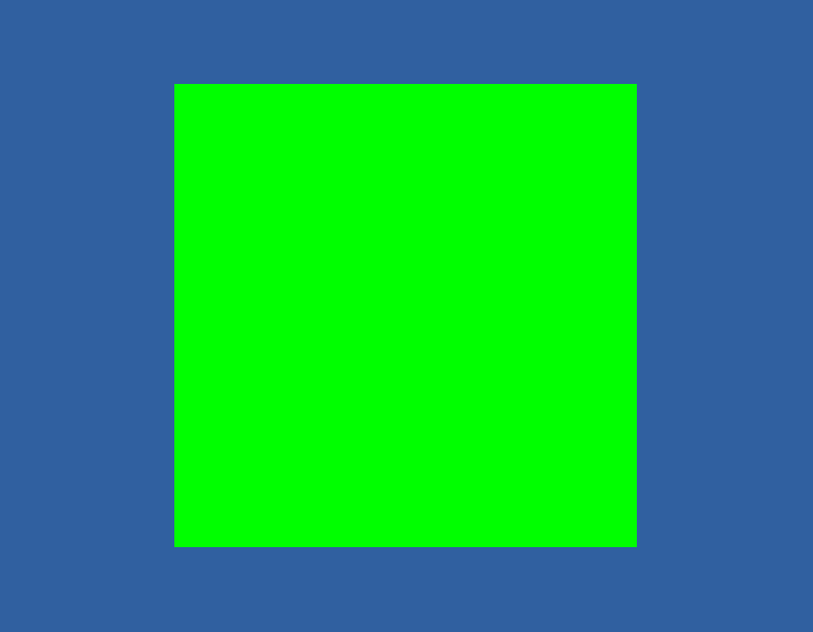
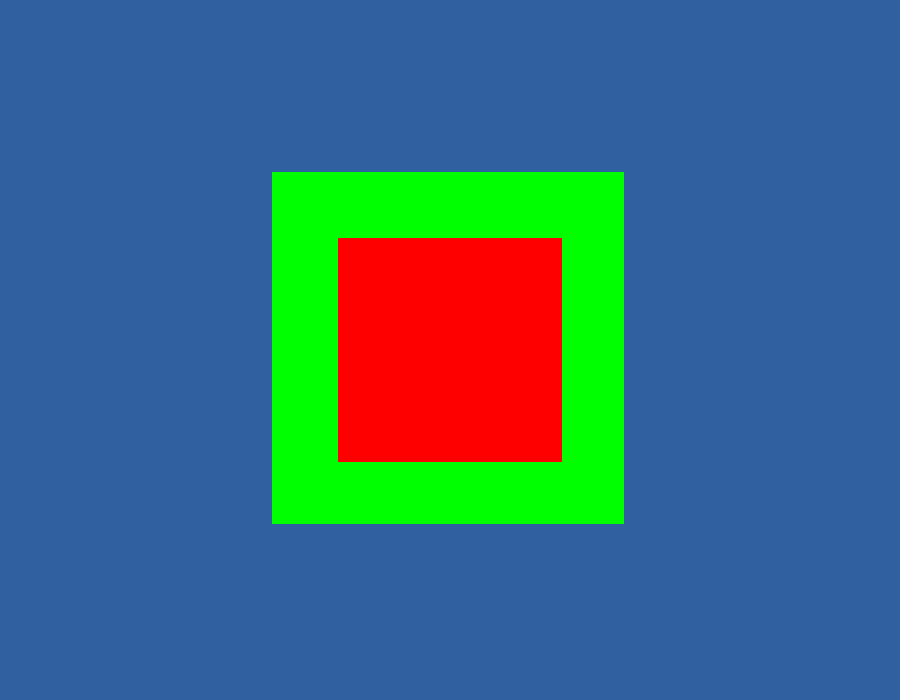
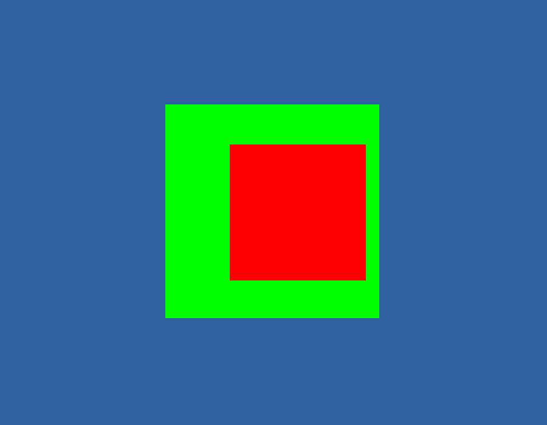
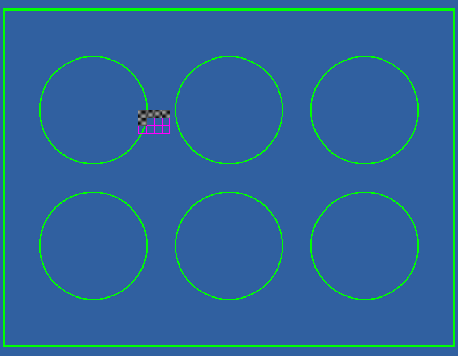
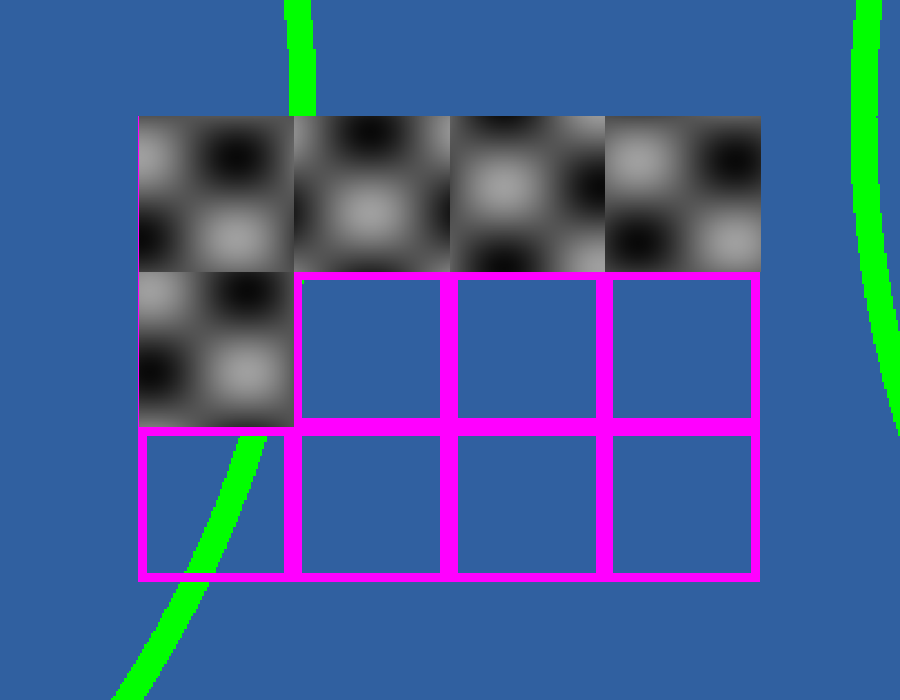
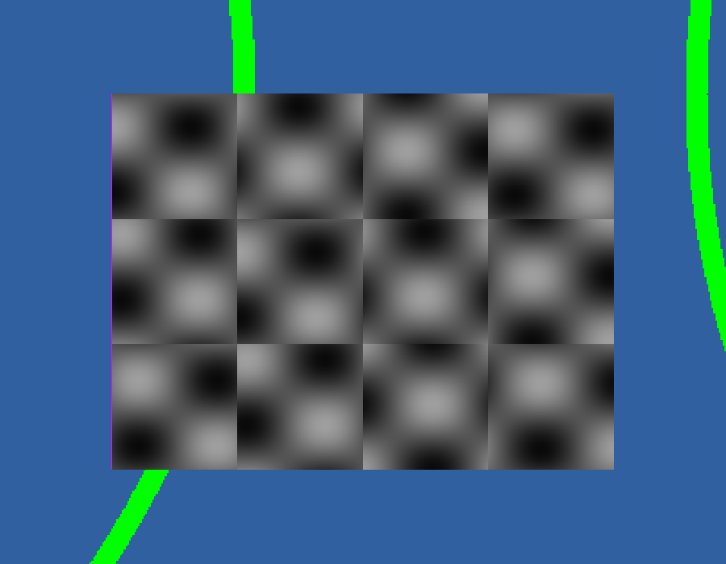
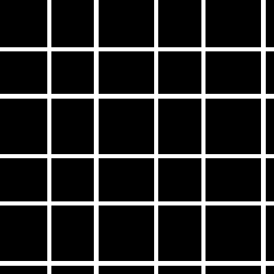
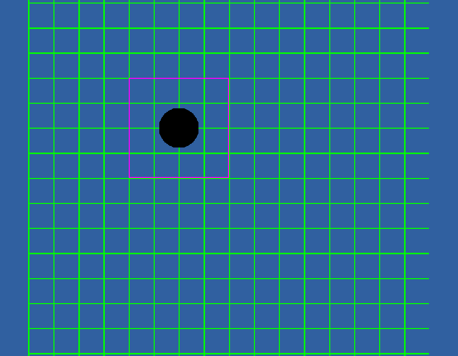

# Can the plate, the plan and the acquisition be stacked inside one flat view?

**Nothing here turned out to be impossible.** The arrangement `LAYERS.md`
describes — the plate layout underneath, the tiles the operator chose above it,
and the acquisition on top with unimaged room drawn see-through — works, and the
assumption everything rested on is now measured rather than reasoned about. Four
things did come out differently from what was expected, and they are flagged
where they arise: an image layer opens at *half* opacity, a coarse layer sits
half a voxel away from a fine one, writing a plate-sized layer takes a minute and
a half rather than a few seconds, and a pattern that dies in the pyramid does not
fade to grey but turns into a solid block.

Measured 2026-07-30. The harness that produced every number is in
`viz_studio/layer_stack/`, the photographs are in
`viz_studio/layer_stack/photographs/`, and the whole run can be made again with

```
npm --prefix viz_studio/layer_stack/page install
npm --prefix viz_studio/layer_stack/page run build
python viz_studio/layer_stack/measure.py --out somewhere --data somewhere/stores
```

Every answer below comes from a photograph of the screen or from a count taken
off the filesystem. Nothing asks the engine whether it is satisfied, because an
engine can report itself perfectly happy while drawing nothing at all — which is
exactly what happened once while this was being built, and is described at the
end.

---

## 1. Does a layer underneath give the layer above its transparency back?

**Yes.** This was the load-bearing assumption and it holds.

The measurement is two image layers on exactly the same ground. The lower one is
imaged everywhere and drawn green. The upper one is imaged over its left half
only and drawn red, with a shader that draws anything never written as nothing at
all. So the right-hand half of the picture is the whole question.



| where | what is showing | the colour read |
| --- | --- | --- |
| where the upper layer was written | the upper layer | 255, 0, 0 |
| **where nobody imaged** | **the lower layer, showing through** | **0, 255, 0** |
| well outside both | the background | 48, 96, 160 |

The green is exact — not a blend, not a dark version of the lower layer, but the
lower layer drawn as though nothing were over it at all. The engine turns
blending off only for whichever layer it draws first and leaves it on for every
layer after that, so putting the plate underneath does make the acquisition's
alpha survive, exactly as hoped.

### With the lower layer taken away


With nothing underneath it, the upper layer's unimaged half shows **the
background**, not black. This is worth knowing because it is the opposite of what
the mechanism suggests: the first layer is drawn with blending switched off, so
one might expect it to paint its see-through parts as solid nothing. It does not.
It writes an alpha of nought into a surface that was cleared to nothing, and the
background shows through when that surface is put on the screen.

### And the check can fail

A reading that has never been seen to fail is not evidence of anything. So the
same measurement was taken again with the upper layer drawn opaque everywhere —
still red, still on top, still with the green layer underneath it, but no longer
see-through anywhere.

| where | with the see-through shader | with the opaque shader |
| --- | --- | --- |
| where nobody imaged | the lower layer (0, 255, 0) | **the upper layer (255, 0, 0)** |

The reading changes completely, so it really is measuring what it claims to. The
photograph is `1-broken-upper-layer-opaque.png`.

### One thing found along the way that changes every result

**An image layer in this engine opens at an opacity of one half, not one.** The
opacity is multiplied into whatever alpha the shader emits, so two layers stacked
at their defaults blend into a mixture rather than one covering the other. A
measurement of transparency taken without noticing would have been measuring the
opacity control instead, and a finished viewer that never sets it would show the
operator a washed-out plate through a half-transparent acquisition. Every layer
in these measurements is given an explicit opacity of one.

---

## 1b. What happens when the operator hides the plate

This follows straight from the question above. If the acquisition's transparency
depended on there being something underneath it, then hiding the plate would
change how the acquisition itself is drawn — and somebody who simply wanted the
plate out of the way would have no reason to connect the two things.

**It does not happen. The lower layers can be switched off freely.**

| what was done | where nobody imaged | where the upper layer was written |
| --- | --- | --- |
| both layers shown | the lower layer (0, 255, 0) | the upper layer (255, 0, 0) |
| the lower layer **hidden** | the background (48, 96, 160) | the upper layer (255, 0, 0) |
| the lower layer left loaded at **nought opacity** | the background (48, 96, 160) | the upper layer (255, 0, 0) |

Hiding the plate leaves the acquisition drawn exactly as it was, and the room
nobody imaged simply shows the background instead of the plate. It does not go
black. In the finished viewer the background is meant to match the page, so what
the operator would see is the plate disappearing and the page showing through —
which is precisely what they asked for.

That also means the question of whether a layer at nought opacity still holds its
place in the stack does not need answering. It was measured anyway and the two
ways of putting a layer out of sight are indistinguishable on screen. There is
nothing here to work around, so neither lower layer has to be kept switched on.

One caution for anyone extending this. When the lower layer was hidden, the
engine still reported that it was drawing two layers while the photograph plainly
showed one. The picture is the verdict and the engine's own count is only a
diagnosis; this is a small, concrete example of why.

---

## 1c. Can several layers show different rectangles of one store?

Asked because of a promising idea: rather than drawing one layer across a run's
whole declared canvas, give each imaged region a bounded layer of its own, so
that ground nobody visited has nothing drawn over it and is see-through by
construction rather than by asking how bright a voxel is. The danger is that this
quietly turns into one *store* per region, which would be fatal — this project
writes one sparse image per acquisition type, and the coordinate system, the
coverage record and the whole layout depend on that.

**The answer is in two halves, and the second one is the one that matters.**

**Several layers can share one store, and they can be placed independently.**
Two layers pointing at the same address both built and both drew, and giving one
of them a transform of its own moved it cleanly sideways. Nothing had to be
written twice on disk.



**But a layer cannot be cropped.** A layer always draws the whole extent of the
store it points at. A source specification accepts a `url`, a `transform`,
`enableDefaultSubsources` and `subsources`, and none of them bounds anything; the
word "crop" does not appear anywhere in the engine's library. Asked for a
rectangle in the only two ways the specification allows, the results were:

| what was asked for | what happened |
| --- | --- |
| a bound written onto the output axes | **silently ignored** — accepted without complaint, and the layer drew its full extent |
| the default subsources turned off and a rectangle asked for by name | accepted, and the layer drew **nothing at all** |



The photograph shows the full square drawn in green when only its top-left
quarter was asked for. That the request was accepted rather than refused is worth
noting on its own: unknown keys in a source specification are ignored without a
word, so a bound that somebody believes they have applied would simply not be
there.

**So the idea as stated needs separate stores, and should be dropped rather than
half-built.** It is worth saying plainly that this costs less than it appears to,
because question 1 has already settled the thing the idea was mainly for:
unimaged ground *is* see-through, and the plate below *does* show through it. What
bounded layers would additionally have bought is the exactness discussed in
question 6 — telling a genuinely black tile from unvisited room — and there are
cheaper ways to get that.

There is a separate and much simpler way to stop the engine asking about ground
nobody imaged, already measured in `SANDWICH.md` §3: bound the *region of the
window the engine is given to draw in* rather than the layer. That cut a redraw
from 256 requests to 25, needs no cropping, and is unaffected by anything here.

---

## 2. Does a coarse layer land correctly against a fine one?

**Yes, to within half a voxel of the coarser layer.**

The plate would be written at ten micrometres to a voxel and the acquisition at
about a third of one — nearly thirty times finer. They are meant to line up
because an OME-Zarr image records the physical size of a voxel and where its
corner sits, and the engine places layers by those physical facts rather than by
counting pixels.

The reading is a border, borrowed from `SANDWICH.md` because it proved itself
there. The coarse layer holds a square 880 micrometres across; the fine layer
holds one 560 micrometres across centred on exactly the same point of the world,
with its own corner deliberately not at the origin so that the recorded corner is
under test too. If both land where they should, the coarse square shows as an
even border 160 micrometres wide all the way round the fine one.



| | across the middle | down the middle |
| --- | --- | --- |
| border before the fine square | 165 µm | 165 µm |
| border after the fine square | 155 µm | 155 µm |
| **how far the two middles are apart** | **5.0 µm** | **5.0 µm** |

Both squares also measured the size they were written at, to within one
photograph pixel: 557.5 against 560 micrometres, and 877.5 against 880. So the
physical size recorded in the store is honoured, and the recorded corner is
honoured, and a coarse layer and a fine one land on the same ground.

### Where the last five micrometres come from

A small disagreement nobody has explained is exactly the kind of thing that turns
out later to have been the first sign of something real, so rather than note it
and move on it was put to a test that could have refuted it.

The guess was that it is half a voxel of the *coarse* layer — that the two images
disagree about whether the number recorded for a corner means the edge of the
first voxel or its middle. If so, doing the whole thing again with the coarse
layer twice as coarse must double it.

| coarse voxel | predicted | measured, across | measured, down |
| --- | --- | --- | --- |
| 10 µm | 4.83 µm | 5.0 µm | 5.0 µm |
| **20 µm** | **9.83 µm** | **10.0 µm** | **10.0 µm** |

It doubled. **The offset is half a voxel of whichever layer is coarser**, and it
is a convention rather than a fault. At the ten-micrometre voxel a plate would be
drawn at, it is five micrometres — far less than the width of the line the well
outline is drawn with, and nothing an operator could see. It is recorded because
it would grow with the voxel size if somebody drew a plate at a hundred
micrometres to a voxel, and because a half-voxel convention is much easier to
recognise when somebody has written down that it exists.

### And the check can fail

The fine image was written a second time with its corner recorded a hundred
micrometres wrong and nothing else changed — which is what this fault would really
look like, a stage position written down slightly wrong or an origin left out.



| | across the middle | down the middle |
| --- | --- | --- |
| how far the two middles are apart | **105.0 µm** | 5.0 µm |
| border before / after | 265 / 55 µm | 165 / 155 µm |

The error appears across the picture, where it was introduced, and not down it,
where it was not. This is the fault worth being frightened of: the photograph
still looks like a perfectly good picture, and only the border shows that the
acquisition is sitting a hundred micrometres from where the microscope says it
was taken.

---

## 3. The whole stack

Three layers on the same ground: the carrier and its wells at the bottom in
green, the tiles the operator planned above it in magenta, and the acquisition on
top drawn as ordinary greyscale picture with unimaged room see-through.



The plate is visible everywhere, and the small patch of run in progress sits
where it belongs on the carrier.



Closer in, this is the picture the whole design is for. Five of the twelve
planned tiles have been imaged and show picture. The other seven show the magenta
rectangle the operator laid out, with the green carrier line running behind it
where it crosses. Picture only where picture was taken; the plan visible
everywhere else; the plate visible behind both.



With every tile written, the grid fills in completely. Read at the middle of each
of the twelve planned tiles, every one shows acquired picture rather than plan or
plate.

Two things worth knowing from this.

**The acquisition covers the plan where the two overlap.** Look at the
part-acquired photograph and the magenta outlines are gone under the five imaged
tiles. That follows from the acquisition being on top and opaque wherever it was
written, and it is almost certainly what an operator wants — but if the tile
outline should stay visible over finished tiles, the plan has to be drawn *above*
the acquisition rather than below it, and `LAYERS.md` currently says below.

**Nothing on disk announces a new tile.** Between the two photographs the engine
had to be asked to let go of what it had decoded, or the tiles written in between
would never have appeared — not slowly, but never. This is not new; it is the
same behaviour `SANDWICH.md` §6 measured, and the viewer's own live path in
`frontend/src/engine.js` already does it. It is repeated here only because a
measurement of a filling-in stack that skipped it would have photographed a run
that appeared to be stuck.

---

## 4. What the plate actually costs

The arithmetic to be checked was: a 128 × 86 mm plate at ten micrometres to a
voxel is about 1,700 pieces, a few hundred kilobytes, and a few seconds to write.
That is 12,800 × 8,600 voxels, or 110 million of them.

| | on disk | files | to write |
| --- | --- | --- | --- |
| flat colour, keeping the smaller copies | 3.33 MB | 1,701 | **97.0 s** |
| flat colour, full size only | 1.96 MB | 1,135 | 95.1 s |
| a patterned background, keeping the smaller copies | 13.69 MB | 2,301 | 97.2 s |
| a patterned background, full size only | 9.83 MB | 1,704 | 96.1 s |

**The piece count was exactly right and the time was wrong by a factor of thirty.**

The 1,701 files for a flat plate with its pyramid is as close to the predicted
1,700 as makes no difference. The size is larger than "a few hundred kilobytes"
but still trivial: three and a third megabytes for a whole plate, and under
fourteen even with a pattern over the whole of it.

The time is the number that matters. **It takes about a minute and a half, not a
few seconds**, and keeping the pyramid is not why — dropping the smaller copies
saved under three seconds. The cost is simply writing and compressing 110 million
voxels. That is perfectly acceptable for something written once per carrier type
and reused by every run on that carrier, which is what this layer is for. It is
*not* acceptable to do while an operator waits, so a plate layout must be
prepared in advance rather than built on demand when a run starts.

**A pattern costs about four times as much on disk as flat colour** — 13.69 MB
against 3.33 — which confirms that a pattern compresses far less well. It makes
no difference to the writing time and the absolute figures are small enough that
it need not weigh on the decision.

---

## 5. Does a pattern survive being shrunk down?

**A pattern with a physical period survives; one defined in voxels does not. But
the way it fails is not the way that was expected, and the difference matters.**

The expectation was that a fine pattern would be *averaged* into flat grey after a
few halvings. It is not, because **this project's writer does not average when it
makes its smaller copies — it takes every second voxel and throws the rest away.**
So a pattern does not fade gently. It either keeps landing on the voxels that are
kept or it does not, and what comes out can be a solid block just as easily as an
empty one.

Both patterns were written into the same 8,192-voxel canvas at ten micrometres to
a voxel, with seven copies kept.

### A line every millimetre — a physical period

| copy | voxels across | one voxel is | share bright | still visible? |
| --- | --- | --- | --- | --- |
| 0 | 8192 | 10 µm | 0.117 | yes |
| 1 | 4096 | 20 µm | 0.117 | yes |
| 2 | 2048 | 40 µm | 0.154 | yes |
| 3 | 1024 | 80 µm | 0.154 | yes |
| 4 | 512 | 160 µm | 0.154 | yes |
| 5 | 256 | 320 µm | 0.157 | yes |
| **6** | **128** | **640 µm** | **0.164** | **yes** |



It survives every copy, right down to the smallest one kept, where a single voxel
covers 640 micrometres. That is the picture above: still plainly a grid.

### A line every four voxels — a period with no physical meaning

| copy | voxels across | one voxel is | share bright | still visible? |
| --- | --- | --- | --- | --- |
| 0 | 8192 | 10 µm | 0.750 | yes |
| 1 | 4096 | 20 µm | 0.750 | yes |
| **2** | **2048** | **40 µm** | **1.000** | **no — solid** |
| 3 – 6 | | | 1.000 | no — solid |


**At the second copy it becomes a solid bright block**, and stays one all the way
down. Every second voxel of a pattern that repeats every four voxels happens to
land on a line, so after two halvings every remaining voxel is a line.

This is worse than fading to grey, and it is worth being clear about why. A grey
rectangle looks like something that has been smoothed. A solid bright rectangle
looks like a real, evenly-illuminated piece of specimen. An operator zooming out
would not see their background pattern disappear; they would see it replaced by
something that looks like data.

**The practical rule is the one that was claimed, and it is now measured: give any
pattern drawn on a plate a period in micrometres, not in voxels, and make it
coarse enough that it still spans several voxels in the smallest copy kept.** A
line every millimetre at ten micrometres to a voxel is a hundred voxels apart and
has enormous room to spare.

---

## 6. The ambiguity that is not yet fixed

Making unimaged room see-through works by asking how bright a voxel is: if there
is nothing there, let whatever is underneath show through. But a place that
genuinely *was* imaged and came back black looks exactly the same to that
question, so it disappears too.

Here it is. The lower layer is a carrier drawing, a green grid. The upper layer
has one tile written into it holding real but very dark picture — mostly nought,
which is what a camera looking at nothing produces once its background has been
taken off, with one faint blob a couple of counts above it so that there is
something there to see. All around that tile is room nobody has visited.



The magenta rectangle is the writer's own record of where the microscope actually
looked. Inside it, the green plate grid shows through exactly as it does outside.
The only thing the operator can see of a genuinely acquired tile is the small
black blob.

| | share of the patch showing the plate underneath |
| --- | --- |
| the dark part of the tile that **was** imaged | 0.046 |
| room beside it that was **never** written | 0.049 |

The two are the same number. There is nothing in the picture to tell them apart,
which is the whole point.

The rectangle had to be drawn from the coverage record because there is no way to
reveal the truth from the picture itself — that *is* the problem. Drawing the
acquisition layer solid instead does not help: it draws the whole declared canvas
solid, including all the room nobody visited, and shows nothing useful.

**The one-line fix in the writer recorded in `OPTIONS.md` has deliberately not
been applied.** This is here so the decision can be made on a picture.

### The four ways out, and what each costs

Recorded together so that nobody has to reopen the question later.

1. **A floor of one** — `image = np.maximum(image, 1)` in the writer, so that
   nought means "nobody has been here" exactly and always. Costs the single value
   nought as a real intensity: one level out of 65,536, and the one meaning
   "darker than nothing". Set out in full in `OPTIONS.md`.
2. **A wider type.** Works, and doubles the storage.
3. **One bounded layer per imaged region.** Exact and needs no convention.
   **Question 1c above settles this one: the engine cannot crop a layer to a
   rectangle, so it would require a separate store per region, and the writer
   must not change.** It should be dropped.
4. **Floating-point voxels with "not a number" for unwritten room.** *Considered
   and rejected without being measured.* It would give an exact "nobody has been
   here" marker with no convention and no intensity given up. But it stores
   thirty-two bits per voxel for a camera that produces sixteen, and the
   acquisition must stay sixteen bits. Whether such a value would survive the
   journey to the shader is therefore unknown, and now does not matter.

That leaves the floor of one as the only candidate that does not cost either the
storage or the writer, which is worth knowing before the picture above is
discussed.

---

## A trap worth writing down

While this was being built, the whole window came out black. Every layer loaded,
every piece of image was fetched and found, the engine reported that it had drawn
three hundred frames, and no error appeared anywhere. The engine's element had
been left to fill its parent by stylesheet alone and had measured nine hundred
pixels wide and **nought** high, so the drawing surface was nine hundred by
nought.

The engine's drawing area has to be given a size in plain pixel numbers, and
given it again whenever the window changes. `SANDWICH.md` §7 already warns about
the second half of this — numbers written once and not written again leave the
engine drawing at the old size — and this is the first half of the same fault.

It is recorded here mainly as one more piece of evidence for the rule this
repository keeps insisting on. Three hundred frames drawn, every layer satisfied,
nothing wrong anywhere, and not one pixel on the screen. Only looking at the
picture found it.

---

## What this does not settle

**It was measured on a machine with no graphics card**, so the engine renders in
software. That does not affect any answer above, because every one of them is
about what colour a pixel comes out rather than about how often a frame arrives.

**The layers here are all image layers, and there are three of them.** Nothing
here measures what happens with a segmentation mask in the stack, or with the
operator's own scribbles on top, or with the number of layers growing as a run
takes several acquisition types. `LAYERS.md` describes five layers; three were
built.

**Nothing here was measured while a run was writing**, except for the single
refresh in question 3. `SANDWICH.md` §5 found that contention on the disk changed
nothing about registration, and there is no reason to expect the stack to behave
differently, but it has not been shown.

**The plate figures are from this machine's disk.** A network share would change
the writing time in question 4, and a plate written once per carrier type is
exactly the sort of thing somebody would keep on a share.
