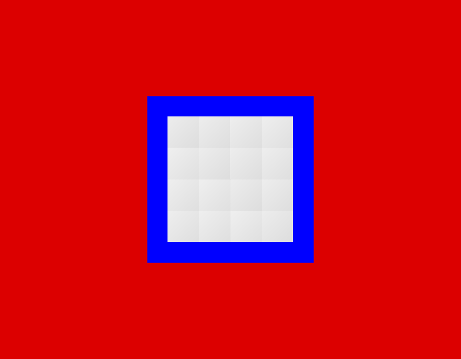
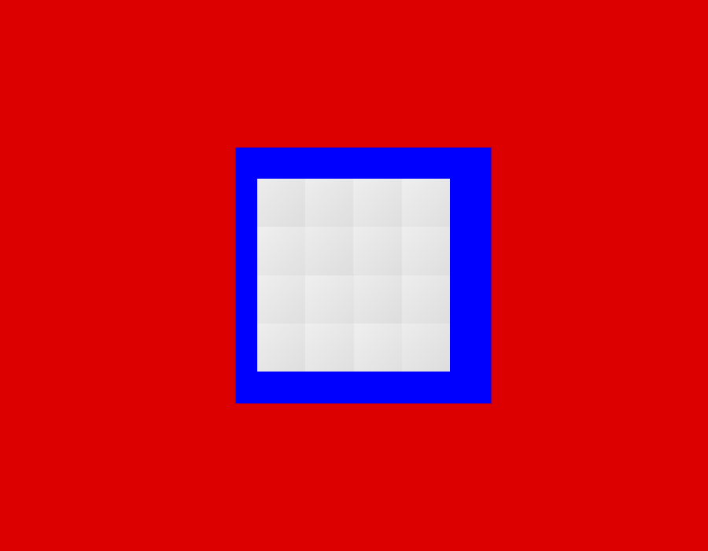
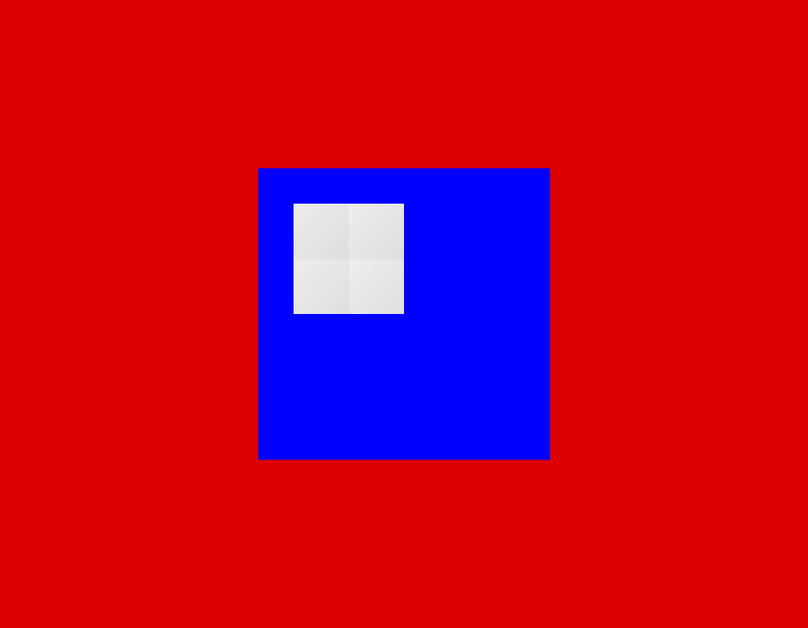
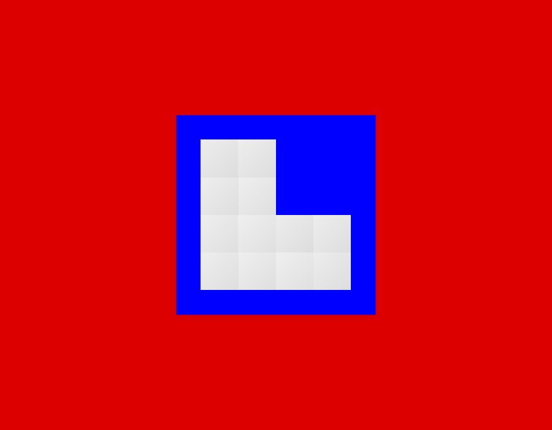
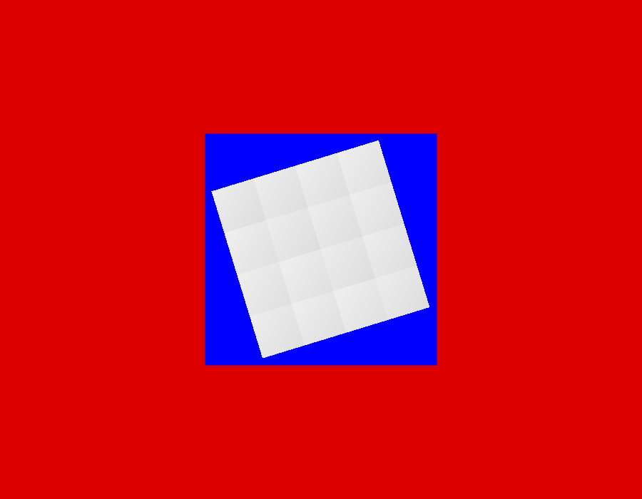

# Can the image be drawn underneath the operator's own drawing?

Measured 2026-07-30. The harness that produced every number here is in
`viz_studio/sandwich/`, the photographs are in `viz_studio/sandwich/photographs/`,
and the whole run can be made again with

```
npm --prefix viz_studio/sandwich/page install
npm --prefix viz_studio/sandwich/page run build
python viz_studio/sandwich/measure.py --out somewhere
```

---

## The question, and the verdict

`LAYERS.md` sets out what is drawn where: the operator's carrier outline and
their tile positions underneath, the acquired image over them, their scribbles
and selection on top. It leaves one thing open — whether the acquired image is
drawn as a layer **inside** the canvas the application owns, or by a second
engine in a canvas of its own **underneath** it, with holes cut in the drawing
above wherever the image should show.

The second arrangement is attractive for real reasons. Neuroglancer already
treats one enormous, mostly-empty acquisition as its whole purpose; it is proven
here on this project's own data; nothing has to be injected into anybody's
library; and the three-dimensional view comes almost free, being the same engine
asked for a different layout.

The doubt is equally real. Two drawing surfaces cannot be handed to the screen in
the same instant. If the drawing on top follows the mouse while the engine
underneath draws on its own schedule, the picture slides out from under the
outlines — and nothing anywhere reports that it has.

**The verdict: the objection is answered, under one discipline, and the
discipline is cheap.**

> Repaint the operator's drawing only from inside the engine's own end-of-frame
> announcement, using the view read at that moment. Do that, and the two layers
> are indistinguishable from being drawn in a single canvas: the deviation
> measured is one pixel, which is the measurement's own floor, and the
> arrangement that cannot possibly come apart measures zero.

Repainting the moment the mouse moves instead — the obvious thing, and the thing
the doubt is about — really does come apart, by up to 25 screen pixels while
panning and 70 while zooming. So the discipline is not decoration; it is the
whole of the answer.

Two things found along the way matter more than the verdict, and both are
described in full further down:

1. **The flat view as this project configures it draws the specimen mirrored
   left to right.** Nothing reports it. It is the same family of fault as a
   rotated view, which `CONTROLS.md` already warns about, and it is quieter. It
   has to be settled before either arrangement ships.
2. **Bounding what the engine draws to the ground a run actually imaged — using
   the coverage record — cuts a redraw from 256 requests to 25, and from 1.30
   seconds to 0.20 on a delay standing in for a network share.** That is the
   arrangement that would ship, and it is the single largest number in this
   document.

---

## How it was measured

### The margin test

Draw a square of real acquired image. In the drawing on top, cut a hole slightly
**larger** than that square and centred on it. What you then see, from the middle
outwards, is the image, a band of the engine's own background showing through the
hole, and the drawing framing the lot. Measure the width of that band on each of
the four sides.



The right answer is "unchanged". So there is no number to interpret and no
threshold to argue over: any disagreement turns into the band becoming **uneven**,
and which way it goes says what went wrong.

- One side thin and the opposite side thick: the drawing on top is placed from a
  position the image has not reached. That is a follower lagging behind.
- All four growing or shrinking together: the two disagree about magnification
  rather than about position.
- The same side disagreeing between one cut across the picture and another: the
  view has been **turned**. This one is why the band is read along three cuts
  rather than one — a square turned by two degrees is almost exactly as wide
  across its middle as it was, so a single cut through the centre reports nothing
  wrong at all.

It also survives this machine, which has no graphics card and renders in
software. That changes *when* frames appear, and so how often a reading can be
taken; it cannot invent a band that is uneven **within a single photograph**,
which is the fault itself.

The reading half lives in `viz_studio/tests/margins.py`, beside `pixels.py`, and
is meant for any two-layer arrangement rather than only this one.
`viz_studio/tests/test_the_margins_stay_even.py` runs it.

### Three colours, and why they must match in the finished viewer

The measurement has to tell three things apart in a photograph, so they are given
three colours nothing could confuse: the image near white, the engine's
background saturated blue, the drawing on top saturated red.

**In the finished viewer the background is meant to match the page, so that the
seam between the two surfaces cannot be seen at all.** That is the whole point of
the arrangement. They differ here only so the band can be seen. That is said at
length in `sandwich/page/src/margin_probe.js` and again in `tests/margins.py`, so
that nobody later "tidies" them into agreement and leaves a check that passes
while measuring nothing.

### Everything came from photographs

Nothing below asks the engine where it thinks it is. An engine can report itself
perfectly satisfied while drawing nothing, and it can equally report the right
position while presenting an older frame. The one exception is a diagnostic that
reads pixels **out of the engine's own drawing surface** at the end of each
frame, which is looking rather than asking, and it is what settled the mirror.

---

## 1. The margins, and the control

Every number is in the photograph's own pixels. The band was cut 40 browser
pixels wide.

| arrangement | at rest | panning | zooming | thrown about |
| --- | --- | --- | --- | --- |
| **both layers in one canvas** (the control) | 0 | **0** | **0** | **0** |
| sandwich, drawing repainted on every mouse move | 1 | **11** | 2, with all four sides moving together by up to **35** | **25** |
| **sandwich, drawing repainted from the engine's last frame** | 1 | **1** | **2** | **1** |

The figures are the worst unevenness seen in any single photograph, over 27 to
147 photographs per gesture taken from a live recording of the screen.

**The control comes out at zero**, which is what makes the rest of the table
mean anything. Both layers inside one canvas are drawn in one pass from one
reading of the view and cannot come apart; had the check found them apart, it
would have been measuring its own noise.

**The proposed arrangement matches the control to within the measurement's own
floor.** That floor is one pixel and comes from the hole falling on fractional
pixel positions, so its soft edge is read as one place or the next.

**Repainting on every mouse move does not.** The two signatures are exactly as
predicted and are worth looking at, because they are diagnostic:



Panning and throwing the view about give one side thin and the opposite side
thick — the band ran from 28 pixels on one side to 53 on the other. Zooming gives
something quite different: all four sides move **together**, from 5 pixels to 75,
with barely any unevenness between them. Adding opposite sides together separates
them cleanly. Under a displacement the pair still comes to twice the width it was
cut at, 81 pixels, because one side gains what the other loses. Under the zoom
mismatch the pair ranged from 11 to 149.

### Whether the engine will tell you what it has just presented

It does not offer a snapshot of the frame it drew. There is no "here is the state
of frame 412". What there is, and what turns out to be enough:

- the engine announces the end of every frame (`display.updateFinished`), and it
  dispatches that announcement **from inside its own drawing function**, which
  the browser is running as part of a single animation frame. Anything painted
  from inside the announcement therefore reaches the screen in the same frame as
  the image, rather than one frame later;
- the engine reads the current view at the moment it draws, so the current view
  read from inside the announcement *is* the view it just drew with.

That second claim was checked rather than believed, by reading pixels out of the
engine's own drawing surface at the end of each frame and comparing where the
edge of the acquisition really was with where the view said it should be. Over a
drag of 30 frames the worst disagreement was **0.5 pixels**.

---

## 2. Which way the specimen faces — the thing that nearly wrecked all of this

The engine draws three chosen axes: one across the window, one down it, one into
the screen. Which is which follows from the *order* the axes are handed over in
together with which of the engine's named layouts is asked for, and the two
interact.

`viz_studio/frontend` hands the axes over in the order the image declares them —
depth, height, width — and asks for the layout the engine calls `yz`. That does
put width across the window and height down it, and it looks entirely right.

It also runs width **to the left**.

| how the axes are handed over | the drawing moved | the picture moved | which way |
| --- | --- | --- | --- |
| as the viewer does it today (`z, y, x` with layout `yz`) | 168 px | 168 px | **−1.0** |
| width first (`x, y, z` with layout `xy`) | 168 px | 168 px | **+1.0** |

A slope of −1 means that when the operator drags to the right, the acquired image
travels to the left. In the sandwich the effect is not subtle — a drag of a
hundred pixels puts the two layers two hundred pixels apart — and the first run
of these measurements read that as a catastrophic lag. It was nothing of the sort.

It matters far beyond this investigation. A mirrored plate view is still a
perfectly good picture: nothing errors, nothing looks wrong, and on a round
specimen or a symmetrical carrier there is nothing to notice. But the operator
who clicks the left-hand well and drives the stage there is driving it to the
wrong one. This is exactly the hazard `CONTROLS.md` sets out for rotation, and
the same argument applies: the correspondence between the application's
coordinates and the store's is the premise the whole front end rests on.

**This needs settling in `viz_studio/frontend` and in `CONTROLS.md`, and it is
independent of which arrangement is chosen.** It is not settled here, because
which handedness a microscopist should see is a decision about the instrument
rather than about drawing, and the measurement can only say that the two
conventions differ and by how much. Everything else in this document was measured
with width running to the right.

### And a constant offset, if there is one

Separate from drift and easy to confuse with it: a fixed difference between where
the application thinks a voxel is and where the engine draws it would not change
as the view moves, so it would never show as the margins going uneven during a
gesture — but it would grow on screen as the operator zoomed in.

Measured at rest across an eightfold range of magnification, the difference
between opposite sides stayed between 0 and 2 photograph pixels and did **not**
grow with magnification. So there is no offset fixed in voxels; what is left is
under a pixel of rounding, which is the engine's canvas being an integer number
of pixels across.

---

## 3. What it costs on a slow disk

The store will live either on the acquisition machine's own disk or on a network
share, and both have to be acceptable. A share is not slower because the data is
bigger; it is slower because every request costs a round trip, and a redraw is
made of hundreds of small ones. So the server was made to wait a fixed time
before answering anything under `/data`, and the measurements were taken at
nothing, at 2 milliseconds and at 20.

The acquisition is the sparse one: a canvas of 8192 by 8192 voxels with a patch
of 1536 by 1536 imaged in the middle of it, which is the shape a real run has.

### Unbounded — the engine drawing the whole declared canvas

| delay per request | requests | of which found | at once | rounds | wall clock |
| --- | --- | --- | --- | --- | --- |
| none | 256 | 9 | 6 | — | 0.48 s |
| 2 ms | 256 | 9 | 6 | — | 0.58 s |
| **20 ms** | **256** | **9** | **6** | **44** | **1.30 s** |

**The arithmetic is confirmed and then some.** The figure to check against was
~250 requests, six at a time, so about 42 rounds, predicting something near 800
milliseconds at 20 ms per request. Measured: 256 requests, six at a time, 44
rounds counted from the times themselves against 42.7 by arithmetic — as close as
makes no difference — and 1.30 seconds against 0.85 predicted. The round count is
exactly right; the wall clock is about half again as long, which is the
per-request cost that is there whether or not a delay is injected.

Note what those requests are: **247 of the 256 are for pieces nobody has
written**. Almost the whole cost of a redraw is asking about ground the
microscope has never been to.

### Bounded to the imaged tiles, using the coverage record

`zmart_storage.coverage` had landed by the time these were taken, so it was used.
The record says which rectangles of the canvas actually hold picture; the engine
is then given only the part of the window that covers them, because the hole in
the operator's drawing is the only place the image shows anyway and there is
nothing to be gained by having it draw anywhere else.

| delay per request | requests | of which found | wall clock |
| --- | --- | --- | --- |
| none | 25 | 9 | 0.09 s |
| 2 ms | 25 | 9 | 0.14 s |
| **20 ms** | **25** | **9** | **0.20 s** |

**256 requests become 25, and 1.30 seconds becomes 0.20.** The requests that go
away are exactly the ones asking about unimaged ground: 247 wasted requests
become 16. This is the arrangement that would actually ship, and it is worth
more than any amount of tuning elsewhere.

Both a local disk and a share are comfortably acceptable, bounded or not. Even
unbounded, 20 milliseconds a request costs 1.3 seconds for a complete redraw of
everything on screen — and a complete redraw only happens when the engine is
asked to let go of what it has decoded, not on every pan.

---

## 4. What a stall does to the *interface*

This is the sharper objection, and it deserves to be taken seriously. Locking the
drawing to the engine's frame makes the lag shared, which is what preserves
registration — but it also means the engine's worst moment becomes the whole
interface's worst moment. The carrier, the tile rectangles, the hover highlight,
the rectangle being dragged: all of them freeze with it. In the single-canvas
arrangement none of that can happen.

Stalled by delaying the server rather than by blocking the page's own thread,
because a real delay is a fetch that has not come back, and how an engine behaves
while waiting for data is precisely what is in question.

| delay | frames that changed | longest freeze | registration |
| --- | --- | --- | --- |
| none | 39 of 42 | 0.68 s | 1 |
| 20 ms | 41 of 42 | 0.60 s | 1 |
| 200 ms | 38 of 41 | 0.64 s | 1 |

**The freeze does not come from the disk.** The longest the picture stood still
while the mouse was moving is the same at 200 milliseconds a request as at none
at all — around six tenths of a second, which is this machine's software renderer
and nothing else. The drag kept following the mouse throughout, and the picture
travelled the same distance across the screen at every delay.

That is worth stating plainly because it is not what the objection assumes. The
engine does not wait for data before drawing. It draws whatever it has and draws
again when more arrives, so a slow share changes *what is in* the picture — more
of it missing, filling in as it comes — rather than whether the interface
responds. At 200 milliseconds a request, 28 of 41 photographs caught the picture
still filling in; registration in the ones where it was whole was unchanged at 1.

### The compromise

Lock only what must register with the image — the edges of the cut-out — and let
the parts the operator is touching run at the rate of the mouse. Measured with a
tile rectangle drawn exactly on the edge of the imaged square, which is where a
tile rectangle belongs, following the pointer while the hole follows the engine.

| delay | registration at the cut-out | sliver, typical | sliver, worst |
| --- | --- | --- | --- |
| none | 2 | 2 px | 6 px |
| 20 ms | 2 | 2 px | 6 px |
| 200 ms | 2 | 2 px | 6 px |

**A narrow sliver, and an acceptable price.** Two pixels typically and six at
worst, unchanged by the delay. Set that against the alternative and there is not
much of a decision: the freeze it buys back does not exist on this evidence.

The honest reading of this section is that the objection, as stated, was not
found. It should be looked for again on real hardware, where the engine's own
frames are fast and the disk is the slowest thing rather than the fifth slowest.

---

## 5. Measuring while a run is writing

A finished store flatters the arrangement. So the margin measurement was run
again with a run writing tiles into the same folder as fast as it could — **1,070
tiles written during the measurement** — while the viewer read from it.

| gesture | unevenness, run writing | unevenness, store finished |
| --- | --- | --- |
| panning | 1 | 1 |
| zooming | 2 | 2 |
| thrown about | 1 | 1 |

No difference at all. Contention on the disk did not change the answer.

---

## 6. Does the engine notice new data arriving?

This is the viewer's whole purpose, and it is the one place where remembering
what has been decoded is exactly wrong. The engine remembers every piece it has
decoded **including the pieces it found to be empty**, with no time limit, so a
tile written into ground it has already looked at is simply never noticed.

Tiles were written, the engine drew them, and then more tiles were written into
room it had already looked at and found empty.

| | share of the window showing acquired picture |
| --- | --- |
| after the first four tiles | 0.024 |
| after eight more were written, without being told | **0.024 — nothing appeared** |
| after being asked to let go of what it had decoded | **0.072** |





Not "slow to appear" — nothing at all, indefinitely. What makes it appear is the
live-refresh path the viewer already has, in `frontend/src/engine.js`: the pieces
live in a background worker and it sends word to that worker to drop them. Three
holders were asked here.

**What it costs** is written out at length in `engine.js` and was not re-measured:
only the pieces actually on screen are fetched again, which follows the size of
the window rather than the size of the specimen. Anything the operator had
scrolled past is dropped and fetched again if they scroll back.

This is not a fact about the sandwich — it is a fact about the engine, and it
applies wherever the engine is put. It is recorded here because a measurement of
a live viewer that did not check it would be measuring a viewer nobody could use.

---

## 7. Two canvases and the size of a screen pixel

Two canvases have to agree about how large a screen pixel is in *real* pixels
rather than browser pixels, and at a density of exactly one they agree by
accident. So the whole margin measurement was run again at a density of 1.5, and
the window was resized half way through.

**The engine takes no account of the screen's pixel density at all.** Its drawing
surface came out 900 by 700 real pixels where the operator's drawing was 1350 by
1050 — one canvas pixel per browser pixel, with the browser scaling it up. There
is no mention of `devicePixelRatio` anywhere in the installed package.

What that costs is **sharpness, not registration**. The margins at a density of
1.5 were 60, 61, 60, 61 photograph pixels against a band cut at 60, with the same
unevenness of 1 as at a density of 1: the geometry agrees exactly, and the image
is simply drawn at two thirds of the resolution the screen can show. On a
high-density laptop screen an operator would see a slightly soft picture under a
crisp drawing.

Resizing the window mid-measurement changed nothing: the surfaces came to 1100 by
620 and 1650 by 930, and the margins stayed at 60, 61, 60, 61.

**One warning found the hard way.** The engine's drawing area is sized by writing
plain pixel numbers onto its element. If those are written once and not written
again, a resized window leaves the engine drawing at the old size — and two
surfaces that disagree about how large the window is disagree about everything
that follows from it. The fix is one line, and it is in
`sandwich/page/src/main.js`.

---

## 8. That only the two gestures move the view

`CONTROLS.md` settles this: in the flat view, **dragging pans and the plain
scroll wheel zooms, and nothing else moves the view.** Note that this differs
from the engine's own defaults, where the plain wheel steps through the stack and
zooming needs ctrl held down.

First, that the two allowed gestures do what they should — read off the picture,
not out of the numbers that were set:

| gesture | what the picture did | margins |
| --- | --- | --- |
| drag | the edge of the acquisition moved 120 pixels | stayed even (1) |
| wheel | the acquisition grew from 244 pixels across to 603 | stayed even (2) |

Then the ones that used to navigate. Each was made in earnest and the photograph
compared with the one before it:

| gesture | view after |
| --- | --- |
| shift and drag (used to rotate) | unchanged, byte for byte |
| the `r` key (used to rotate) | unchanged, byte for byte |
| the `e` key (used to rotate) | unchanged, byte for byte |
| shift and the arrow keys (used to tilt) | unchanged, byte for byte |
| ctrl and the wheel (used to zoom) | unchanged, byte for byte |
| the right button (used to recentre) | unchanged, byte for byte |
| the arrow keys (used to step sideways) | unchanged, byte for byte |

An unbound gesture and a gesture nobody tried look exactly alike on screen, so
the page counts what it refused as well as what it accepted: one shift-drag, one
right-button click, five ctrl-wheels and fourteen key presses arrived and were
turned away, while one drag and five wheels were accepted. The gestures were
made.

**The sandwich makes this easier rather than harder**, and it is worth knowing
why. The operator's drawing lies over the engine and catches every gesture, so
the engine never receives one and its own binding table is never consulted — it
is left empty. The engine's defaults stop being a hazard, and the whole of the
responsibility moves into our own code, where it is written out one refusal at a
time.

There is one thing to know about laying a drawing over the engine: it does not
happen by putting it later in the page. The engine builds a small tree of
elements with a stacking order of their own, and left alone those escape into the
page's own order and end up **above** anything placed after them. The first
version of this probe painted the drawing over the image perfectly while every
click and drag was quietly caught by the engine's panel underneath it. Two lines
of stylesheet fix it — give the engine's element a stacking order of its own and
make it transparent to the mouse — and both are commented in
`sandwich/page/index.html`.

---

## 9. And the checks can fail

A check that has never been seen to fail is not evidence of anything. Both of the
ones this document leans on were broken deliberately.

| what was broken | unevenness along the middle | slant across three cuts |
| --- | --- | --- |
| nothing — lined up | 1 | 0 |
| the hole moved 2 browser pixels | **5** | — |
| the hole moved 8 browser pixels | **17** | — |
| the view turned 2 degrees | 1 — **missed** | **5** |
| the view turned 15 degrees | 2 — **missed** | **44** |



The rotation rows are the interesting ones. **A single cut through the middle of
a square cannot see a turned view at all** — the square is almost exactly as wide
across its middle as it was, so the reading barely moves even at fifteen degrees.
Reading the band along three cuts and comparing them with each other catches two
degrees comfortably. If you take one thing from this file into another two-layer
check, take that.

---

## What this does not settle

**It was measured on a machine with no graphics card.** Software rendering means
frames arrive far less often than they would on real hardware — around fifteen a
second here — so every gesture was made in fewer, larger steps than a real hand
would make, and the engine was never the fast thing waiting on a slow disk. The
margin readings are not affected by that, because a band that is uneven within one
photograph is uneven whenever the photograph was taken. The *stall* readings are
affected by it, and section 4 says so: the freeze that section looked for was
swamped by this machine's own slowness and should be looked for again on real
hardware.

**The operator's drawing here is a plain two-dimensional canvas**, not a second
WebGL canvas. That is a fair implementation of what `LAYERS.md` describes — a
handful of shapes redrawn as often as the mouse moves — but the doubt as
originally stated was about two *WebGL* canvases, and this does not answer that
version of it. If the operator's layer ends up being drawn by deck.gl, the same
measurement should be run again with the drawing in a WebGL canvas. The harness
takes an arrangement by name, so that is a new arrangement rather than a new
harness.

**The control stands in for the single-canvas arrangement rather than being it.**
It draws the same acquired square, read back out of the same store, with the
drawing over it, in one canvas through one engine in one pass — which is the
property that makes registration exact. It is not reading the store through the
reader the real single-canvas arrangement would use; whether that reader can read
what this project writes was settled separately and is in `DRAWING_ENGINES.md`.

**The engine's embedding problems do not go away by putting it underneath.** All
of the ones listed in `DRAWING_ENGINES.md` were met again while building this:
its build step overwrites files inside `node_modules` and a clean install undoes
it; its second worker only resolves when the page is served from the root of a
site; every import is through a path the package calls `unstable`. Two more to add
to that list, both found here:

- **A layer given an address beginning with a slash is never fetched, and nothing
  says so.** The layer is built, no error is raised, no request is made, and the
  page simply waits for ever. The address has to carry the site's own name at the
  front. The viewer's own scene builder already does this; it is not written down
  anywhere as a thing that must be done.
- **The engine's elements escape the element you put them in**, as described in
  section 8.
