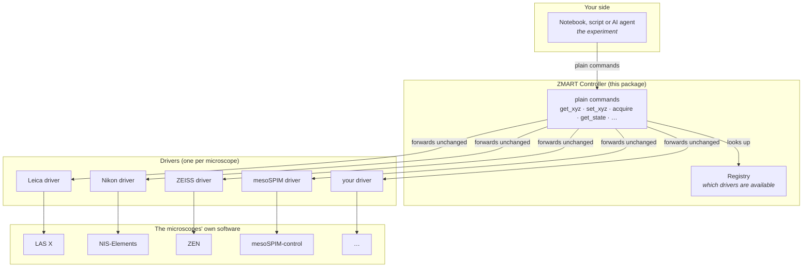
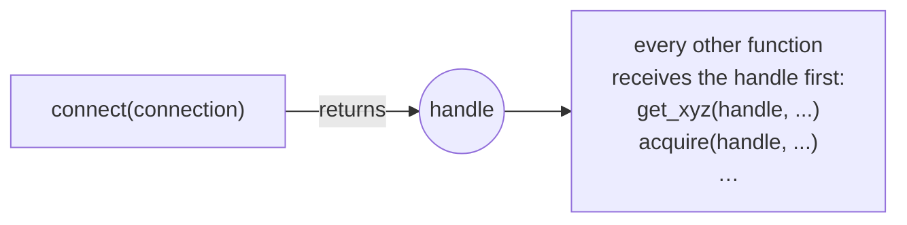

# ZMART Controller

[](https://www.python.org/downloads/)
[](https://github.com/thomdehoog/ZMART-microscopy/blob/main/LICENSE)
[](#)

**One small, consistent way to drive any microscope from Python.**

The ZMART Controller gives you a short list of plain commands — move here, capture an
image, remember these settings, run the autofocus — that mean the same thing on
a Leica, a Nikon, a ZEISS or an open-source light-sheet. You write your
experiment once, against these commands. A small *driver* for each microscope
translates them into that microscope's own software.

It is developed at the Center for Microscopy and Image Analysis (ZMB),
University of Zurich, as the foundation of
[ZMART Microscopy](https://github.com/thomdehoog/ZMART-microscopy).

---

## What problem it solves

Every microscope vendor ships its own programming interface. Each one names
things differently, counts positions from a different corner, uses different
units, and reports errors in its own way. In practice this means that a script
written for one microscope does not run on another. A smart-microscopy
experiment — look, decide what is interesting, go back and image it in
detail — is usually rewritten from scratch for every instrument, and often by
someone who mostly wanted to do biology.

The controller separates the two things that change at different speeds:

- **Your experiment** — *which* positions to visit, *which* settings to use,
  *what* to do with the result. This is the part you care about, and it should
  not depend on the brand of the microscope.
- **The microscope's own software** — *how* to talk to it. This is written
  once per instrument, in a driver, by whoever knows that instrument best.

The controller is the thin, fixed line between them.

## The picture



Read it from top to bottom. Your notebook only ever talks to the controller.
The controller never does any microscope work itself; it hands each command to
the driver of the microscope you picked and passes the answer straight back.
Each driver speaks one microscope's native language. Adding a new microscope
means adding one driver; nothing above it changes.

## Quick start

The controller has no dependencies beyond Python 3.10 or newer. It ships with a
**mock microscope** — a pretend instrument that lives entirely in memory — so
you can try every command without any hardware.

```python
import zmart_controller

# 0. Make the pretend microscope available. With a real microscope you would
#    import its driver here instead, which registers it in the same way.
from zmart_controller.tests import mock_driver
mock_driver.register_mock()

# 1. See which microscopes are available, and connect to one.
instruments = zmart_controller.get_instruments()
zmart_controller.set_instrument(instruments[0])

# 2. Move 100 µm along x, and take a picture.
zmart_controller.set_xyz(100, 0, 0)
record = zmart_controller.acquire(acquisition_type="prescan", position_label="A1")

# 3. Close the connection when you are done.
zmart_controller.disconnect()
```

The notebook [`example_experiment.ipynb`](example_experiment.ipynb) walks
through a complete overview-then-detail experiment on the mock, cell by cell.

## Everything you can call

There are thirteen commands, grouped by what they are for. Most of them come in
pairs: a `get_*` that tells you what is possible, and a matching call that
does it.

| What you want to do | Ask first | Then do it |
|---|---|---|
| Choose a microscope | `get_instruments()` | `set_instrument(instrument)` |
| Learn about the setup | `get_info()` | — |
| Move the stage or focus | `get_actuators()`, `get_xyz()` | `set_xyz(x, y, z, with_actuators=...)` |
| Save and restore settings | `get_state()` | `set_state(state)` |
| Capture and save an image | `get_acquisition_options()` | `acquire(acquisition_type, position_label, options=...)` |
| Run a built-in routine (e.g. autofocus) | `get_procedures()` | `run_procedure({"name": ...})` |
| Finish | — | `disconnect()` |

Each command is described below in the order you would normally use them.

### Choose a microscope

`get_instruments()` lists every microscope whose driver is installed, without
connecting to anything. Each entry is a small dictionary. Three keys —
`vendor`, `microscope` and `api` — say which driver it is. Any other keys are
settings that driver needs to connect, such as a host name or a client name.

```python
zmart_controller.get_instruments()
# [{"vendor": "mock", "microscope": "mock-scope", "api": "mock-api", "client": "mock-client"}]
```

You may edit an entry before connecting, for example to fill in a password.
`set_instrument()` hands the whole dictionary to the driver unchanged and opens
the connection.

### Where positions are measured from

Every position you read or give is in micrometers from the microscope's
*origin*, its (0, 0, 0) point. You do not set the origin in your experiment.
It is part of the driver's configuration: you set it once, in a separate setup
step with the driver, the driver saves it to a file, and it loads it every time
it connects. This is the same way the travel limits and the calibration are
handled. Because of this, the same list of positions means the same places on
the sample every time you connect, and your experiment code stays free of
microscope-specific setup.

### Move

`get_actuators()` tells you which motors can move each axis. Many microscopes
have more than one way to move in z: a large, slow motor for coarse focus and a
small, fast piezo for fine steps. `set_xyz()` moves to a position, and the
optional `with_actuators` picks which motor does the moving. The coordinates
you give stay the same either way; the driver takes care of the conversion.

```python
zmart_controller.get_actuators()
# {"x": ["motoric"], "y": ["motoric"], "z": ["motoric", "galvo", "piezo"]}

zmart_controller.set_xyz(10, 20, 5, with_actuators={"z": "piezo"})
zmart_controller.get_xyz()
# {"x": {"value": 10, "actuator": "motoric", "unit": "um"}, ...}
```

The names differ between microscopes (the Leica driver calls its z motors
`"z-wide"` and `"z-galvo"`), so always ask with `get_actuators()` before you
choose. Asking for a motor that does not exist raises a clear error rather
than moving the wrong one.

### Save and restore settings

A *state* is a snapshot of the microscope's settings that you can capture now
and apply again later — for example, a gentle overview setting and a detailed
high-resolution setting. It has two parts:

- `"changeable"` holds the settings that `set_state()` will apply.
- `"observed"` is a read-only report: which microscope this is, which
  objective is in place, the pixel size, and so on. It is useful to record
  alongside your data, and it is never used as an instruction.

```python
overview = zmart_controller.get_state()
overview["changeable"]          # e.g. {"laser_power": 5.0, "gain": 1.0}
zmart_controller.set_state(overview)
```

What exactly is inside a state differs between microscopes, because the
microscopes themselves differ. The controller does not look inside it; it
simply carries it between your code and the driver.

### Capture and save

`get_acquisition_options()` lists the choices the driver offers for capturing
and saving, with the allowed values and the one currently in use:

```python
zmart_controller.get_acquisition_options()
# {"format": {"options": ["ome-tiff", "ome-zarr"], "active": "ome-tiff"}, ...}
```

`acquire()` captures one dataset **and** saves it in a single step.
`acquisition_type` says what kind of scan this is (for example `"prescan"` or
`"targetscan"`), and `position_label` is the name that appears in the saved
files and records. Any option you leave out keeps its current value, so you
only mention what you want to change.

```python
zmart_controller.acquire(
    acquisition_type="targetscan",
    position_label="cell_07",
    options={"format": "ome-zarr"},
)
```

The call returns a record describing what was saved: at least the
`acquisition_type` and `position_label` you gave, plus where the files went.

### Run a built-in routine

Microscopes have routines that are not simply "move" or "capture": hardware
autofocus, finding the sample surface, turning on a focus-lock system.
`get_procedures()` lists them, and `run_procedure()` runs one by name:

```python
zmart_controller.get_procedures()
# {"autofocus": {"description": "hardware autofocus"}, ...}
zmart_controller.run_procedure({"name": "autofocus"})
```

### Learn about the setup

`get_info()` returns a fresh description of the connected setup. Every driver
reports `output_root`, the folder where images are saved. Anything else in it
is an *extra* of that particular driver. For example, the Leica driver also
reports the tile positions you drew in LAS X. Extras are handy at one
microscope, but an experiment that depends on them will not run on the others,
so keep your positions and plans in your own code.

### Finish

`disconnect()` closes the connection. It is safe to call twice.

## Design philosophy

These are the rules the controller follows. They are the reason it can stay
small while the microscopes underneath it are very different.

**1. Boring on purpose.** The controller does no microscope work of its own. It
does not convert units, correct positions, remember options or check settings.
It passes each command to the driver and passes the answer back. Every check
lives in the driver too: whether the connection is still open, whether an
option exists, whether a move is safe. Everything that needs knowledge of a
specific instrument lives in that instrument's driver, where the people who
understand it can maintain it. Inside, the controller is one small class
whose methods each call the matching driver function.

**2. One call, one finished action.** Every command is synchronous: the
controller calls the driver, the driver does the work on the microscope, and
the command returns only when that work is done. Nothing keeps running in the
background after a command returns. A live view, where you adjust settings
while watching the image and then snap, is a natural future addition, but it
needs a different kind of command and is deliberately not part of the
controller yet.

**3. Interoperable first.** The contract contains only what every microscope
can honestly provide. A driver may add extras to its answers, but an extra is
never part of the contract, and an experiment written against the contract
alone runs on every microscope that has a driver.

**4. Ask first, then act.** Most commands come as a pair: a `get_*` that shows
what the microscope can do, with the allowed values and the current one, and a
matching call that does it. You never have to guess names from documentation,
and a script can adapt itself to whichever microscope it finds.

**5. The driver owns the physics.** Where zero is, how a piezo step relates to
a motor step, how a different objective shifts the image, what the safe travel
limits are — all of this is calibration, and calibration belongs to the driver.
Each driver sets this up once, saves it as configuration and loads it when it
connects. Your experiment speaks only in micrometers from that origin.

**6. Only change what you mention.** Any option you leave out keeps the
microscope's current value. A short call does a small thing.

**7. Settings are a snapshot, not a schema.** Microscopes differ too much for a
single list of settings to fit them all honestly. A state is a snapshot you can
capture and reapply, split into what you may change and what is only reported.

**8. Fail loudly and clearly.** When something goes wrong, the driver raises an
error; it never hides a failure inside a normal-looking answer. Mistakes in
your request raise `ValueError`; problems on the microscope raise
`RuntimeError`. Error messages never repeat passwords or other secrets from the
connection settings.

**9. Nothing hidden, nothing cached.** Every `get_*` asks the microscope
afresh, so what you see is what the microscope reports now, not what it
reported ten minutes ago.

**10. Plug in, don't patch.** Adding a microscope never means changing the
controller. A driver registers itself, and the controller never imports any
vendor code. That is also why the controller itself has no dependencies.

**11. Readable by people and by AI agents.** The whole surface is a few
commands with plain names and plain dictionaries. That makes it easy to learn
at the microscope, and equally easy for an AI coding assistant to drive
correctly.

## Adding a microscope (writing a driver)

A driver is simply a set of Python functions, one for each command, collected
in a dictionary and handed to the controller's registry. There is no base class
to inherit from.

### The shape of a driver



`connect` receives the connection dictionary and returns a **handle**: any
object you like that holds the live connection to your microscope. Every other
function receives that handle as its first argument. The controller never looks
inside it.

### A minimal driver

```python
from zmart_controller.registry import register

def connect(connection):
    client = MyVendorClient(host=connection["host"])
    # The origin is this driver's configuration: saved once by its own setup
    # step, and loaded here every time the microscope connects.
    return {"client": client, "origin": load_saved_origin()}

def get_xyz(handle, *, with_actuators=None):
    raw = handle["client"].read_position()
    return {
        axis: {"value": raw[axis] - handle["origin"][axis], "actuator": "motoric", "unit": "um"}
        for axis in ("x", "y", "z")
    }

# ... one function for each command in the table below ...

register(
    {"vendor": "acme", "microscope": "acme-5000", "api": "acme-sdk", "host": "localhost"},
    ops={
        "connect": connect,
        "disconnect": disconnect,          # optional
        "get_info": get_info,
        "get_actuators": get_actuators,
        "get_xyz": get_xyz,
        "set_xyz": set_xyz,
        "get_state": get_state,
        "set_state": set_state,
        "get_acquisition_options": get_acquisition_options,
        "acquire": acquire,
        "get_procedures": get_procedures,
        "run_procedure": run_procedure,
    },
)
```

Importing your driver module runs `register(...)`, and from then on your
microscope appears in `get_instruments()`. The mock driver in
[`tests/mock_driver.py`](tests/mock_driver.py) is a complete, readable driver
of about 300 lines; it is the best place to start.

### What each function receives and returns

These are the parts every driver must provide, so that an experiment written
for one microscope keeps working on another. A driver may add extra keys to any
answer; it should not leave out the ones listed here.

| Function | Receives | Must return |
|---|---|---|
| `connect` | the connection dictionary | a handle (anything) |
| `disconnect` *(optional)* | handle | nothing; afterwards, every other call should raise `RuntimeError` |
| `get_info` | handle | a dictionary containing `output_root` |
| `get_actuators` | handle | `{axis: [actuator names]}` for `x`, `y`, `z` |
| `get_xyz` | handle, `with_actuators=` | `{axis: {"value", "actuator", "unit"}}` for `x`, `y`, `z`, in micrometers from the origin |
| `set_xyz` | handle, `x`, `y`, `z`, `with_actuators=` | a dictionary containing `position` and `actuators`; raise if the move cannot be confirmed |
| `get_state` | handle | `{"changeable": {...}, "observed": {...}}` |
| `set_state` | handle, state | a dictionary reporting what was applied; act on `changeable` only |
| `get_acquisition_options` | handle | `{name: {"options": [...], "active": value}}` |
| `acquire` | handle, `acquisition_type=`, `position_label=`, `options=` | a record containing `acquisition_type`, `position_label` and the saved file paths |
| `get_procedures` | handle | `{name: {"description", ...}}` |
| `run_procedure` | handle, `{"name": ..., ...}` | a dictionary containing `ran`; raise `ValueError` for an unknown name |

When the allowed values of an option cannot be listed (a number, for example),
`"options"` may be a short description such as `"float > 0"`.

### Rules for drivers

- **Report failure by raising.** Use `ValueError` when the request itself is
  wrong (an unknown option, a position outside the limits) and `RuntimeError`
  when the microscope fails or refuses. Never return a normal-looking answer
  that quietly means "this did not work".
- **Reject what you do not understand.** An unknown option name or procedure
  should raise `ValueError`. A typo such as `exposre_ms` that is silently
  ignored can cost someone an entire experiment.
- **Keep secrets out of error messages.** The connection dictionary may hold
  passwords. Name the keys, never the values.
- **Keep safety in the driver.** Travel limits, collision checks and anything
  else that protects the instrument or the sample belong in the driver, because
  only the driver knows the hardware.
- **Test against the mock's tests.** The tests in [`tests/`](tests/) show the
  behaviour a workflow relies on; running your driver through the same
  scenarios is the quickest way to find gaps.

## Using more than one microscope at once

The short `zmart_controller.acquire(...)` style keeps one *active* microscope
at a time; choosing a new one closes the previous one. To drive two microscopes
side by side, hold each connection yourself:

```python
from zmart_controller.layer import set_instrument

confocal = set_instrument(instrument_a)
lightsheet = set_instrument(instrument_b)
confocal.acquire(acquisition_type="prescan", position_label="A1")
lightsheet.set_xyz(0, 0, 100)
```

Two small cautions apply to the short style. First, always call through the
module, as in `zmart_controller.set_xyz(...)`; a command saved into a variable
keeps pointing at the old microscope after you switch. Second, the short style
assumes a single thread; from several threads, give each its own connection
object as shown above.

## Available drivers

| Microscope | Vendor software | Status |
|---|---|---|
| Leica STELLARIS 5 | LAS X (CAM / Navigator Expert) | Production-tested on the simulator and a real STELLARIS |
| mesoSPIM light-sheet | mesoSPIM-control | Validated against the demo mode; real hardware pending |
| Nikon Ti2 | NIS-Elements 6.10 | Validated against the Nikon simulator; real hardware pending |
| ZEISS | ZEN 3.13 / 3.14 (ZEN API) | Validated against a test gateway; real hardware pending |
| Evident FV4000 | FLUOVIEW RDK | Under investigation |

The drivers live in the
[ZMART Microscopy](https://github.com/thomdehoog/ZMART-microscopy/tree/main/zmart_drivers)
repository, each with its own README describing the instrument's quirks.

## Status

This is version 0.1. The commands are stable in spirit, but the exact
contents of each answer are still being aligned across drivers, and small
changes may happen before 1.0. If you write a driver, please open an issue so
we can keep the contract honest together.

## Tests

```bash
python -m pytest zmart_controller/tests
```

The tests run offline against the mock microscope and take well under a
second.

## Author

Thom de Hoog — Center for Microscopy and Image Analysis (ZMB), University of
Zurich (thom.dehoog@zmb.uzh.ch, thomdehoog@gmail.com).

Released under the MIT License.
